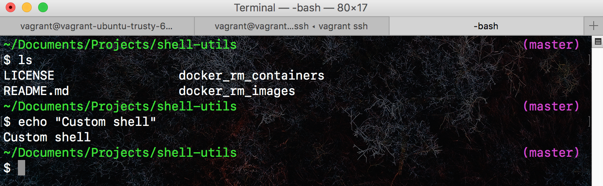

# Shell utilities

Shell utilities for everyday tasks


### .bash_profile

Custom shell profile that shows current working directory and git branch on the left. Looks following:




## Adding to path

To add this repository to PATH, run the following command. You need to add pwd to the export.

```
echo pwd
export PATH="<pwd>:$PATH"
```
